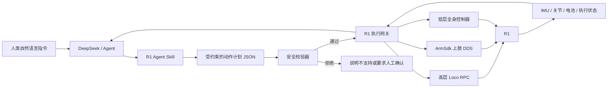

我们现在搜集了一批R1的资料，我们现在想要新建一个项目文件夹，做一个R1的agent skill项目。具体来说就是我们制作一个agent skill，关于如何操作R1实现人类要求的动作。整体流程是人类输入指令（如原地跳舞然后弯腰鞠躬后敬礼）给agent，如deepseek，然后deepseek根据这个skill来操作R1，通过网线/无线网络的形式传输指令，最终使得机器人能够按要求执行复杂运动任务。你可以先查看我发送的R1资料，思考有什么好的实现路径，然后给我讲讲思路


结论：这个方向可行，但应把它设计成“自然语言动作编译器 + 安全执行网关 + 已验证动作库”，而不是让 DeepSeek 直接生成关节角度或 DDS 指令。

Agent Skill 负责理解“原地跳舞，然后鞠躬，最后敬礼”；真正控制 R1 的应是确定性程序。这样既能组合复杂动作，也能把失控风险降下来。

我只把资料中的操作步骤视为参考信息，没有执行其中的机器人操作。

## 推荐的整体架构

````

````

最重要的原则是：

- LLM 只生成动作意图和顺序。
- LLM 不能直接输出 500Hz `LowCmd`。
- 机器人只能执行动作库中已注册、已验证的动作。
- 新动作必须先在仿真、吊架和人工监督环境中验证，之后才能进入动作库。

DeepSeek 模型本身也不能因为“读了 Skill”就自动访问机器人网络；它必须具备工具调用能力，由 Skill 调用本地程序或 HTTP API。

## 为什么需要三层运动能力

R1 的现有接口可以分成三个等级。

| 等级              | 适合做什么                                    | 接口                   | 建议                          |
| ----------------- | --------------------------------------------- | ---------------------- | ----------------------------- |
| A：官方高层动作   | 站立、行走、旋转、停止、挥手、握手、躺下/起立 | `LocoClient` RPC       | MVP 优先使用                  |
| B：自定义上肢动作 | 敬礼、摆臂、转头、简单舞蹈上半身              | `rt/arm_sdk`           | 做成经过验证的轨迹模板        |
| C：动态全身动作   | 真正的鞠躬、下蹲、复杂舞蹈、跳跃              | `rt/lowcmd` 或 RL 策略 | 后期开发，不能让 LLM 即兴生成 |

资料已经证明高层接口支持行走、速度控制、挥手、握手和起立等动作，详见 [高层接口整理](/Users/jamie/Desktop/教育/R1资料搜集/03_R1官方例程_高层接口.md) 和 [官方高层运动服务接口](/Users/jamie/Desktop/教育/R1资料搜集/官方文档/32_软件服务接口/36_高层运动服务接口.md)。

自定义上肢可以通过 `rt/arm_sdk` 控制双臂、腰偏航和头部，并且可以与内置行走控制器同时工作。因此“敬礼”比较适合直接做成第一个自定义动作。

“鞠躬”则比表面看起来难：R1 上肢接口没有直接提供身体前俯所需的完整髋、膝、踝协同控制。真正自然且不摔倒的鞠躬需要全身轨迹或平衡策略，不能只修改一个腰关节。

## 示例指令如何执行

用户说：

> 原地跳舞，然后弯腰鞠躬，最后敬礼。

Skill 不直接给机器人发指令，而是先产生类似这样的计划：

```
{
  "robot_model": "r1-edu-26dof",
  "steps": [
    {
      "action": "dance_in_place",
      "variant": "side_step_v1",
      "duration_s": 8
    },
    {
      "action": "bow",
      "variant": "balanced_bow_v1"
    },
    {
      "action": "salute",
      "side": "right",
      "hold_s": 1.5
    }
  ],
  "constraints": {
    "minimum_clearance_m": 1.5,
    "maximum_duration_s": 20,
    "require_operator_enable": true
  },
  "on_failure": "controlled_stop"
}
```

然后网关逐步处理：

1. 确认机器人型号、固件、当前姿态、运控模式和网络状态。
2. 检查 `dance_in_place`、`balanced_bow_v1`、`salute` 是否已在动作库注册。
3. 检查这些动作能否在同一种控制模式下连续运行。
4. 校验环境空间、机器人倾角、电机温度和动作时长。
5. 执行动作，并持续读取 IMU、关节和服务状态。
6. 任一步超时、倾角异常或通信中断，立即中止后续动作。

如果 `balanced_bow_v1` 尚未经过真机验证，计划必须被拒绝或退化成“点头致意”，不能由 LLM 临时编造一段全身关节轨迹。

## R1 执行网关怎么部署

我建议把网关部署在 R1 EDU 的 PC1 上，而不是让云端 Agent 直接加入 DDS 网络。

资料显示：

- 主控位于 `192.168.123.161`。
- 可开发计算单元 PC1 位于 `192.168.123.164`。
- R1 内部主要通过 DDS/RPC 通信。
- 外部网络可以通过有线或无线进入。

参考 [软件架构说明](/Users/jamie/Desktop/教育/R1资料搜集/官方文档/23_应用开发/25_软件架构说明.md)。

推荐链路是：

```
DeepSeek
   │ 低频 JSON/HTTP/WebSocket
   ▼
PC1 上的 r1-gateway
   │ 本机 DDS/RPC
   ▼
R1 主控
```

这样有几个好处：

- Agent 可以部署在笔记本、服务器或云端。
- DDS 和高频控制留在机器人局域网内。
- Wi-Fi 中断时，机器人侧看门狗仍然能停止动作。
- DeepSeek 只获得有限的机器人工具，不获得任意系统命令权限。
- 将来更换 LLM，不需要修改机器人控制层。

开发阶段优先网线；无线适合只传输低频动作计划和状态。高频关节控制不要经过不稳定的 Wi-Fi 链路。

## Skill 与工程代码应分开

建议项目根目录暂定为 `r1-agent-motion`，其中真正的 Skill 名可以叫 `control-unitree-r1`：

```
r1-agent-motion/
├── skill/
│   └── control-unitree-r1/
│       ├── SKILL.md
│       ├── agents/
│       │   └── openai.yaml
│       ├── scripts/
│       │   └── r1ctl
│       └── references/
│           ├── capabilities.md
│           ├── safety-rules.md
│           └── motion-plan-schema.md
├── gateway/
│   ├── API 服务
│   ├── R1 SDK 适配层
│   ├── 状态监控
│   └── 看门狗与日志
├── motion-library/
│   ├── wave/
│   ├── salute/
│   ├── dance-in-place/
│   └── bow/
├── schemas/
│   └── motion-plan.schema.json
├── simulator/
└── tests/
```

其中：

- `SKILL.md`：告诉 Agent 如何理解动作、何时拒绝、如何调用 `r1ctl`。
- `r1ctl`：提供 `status`、`plan`、`execute`、`cancel`、`list-actions` 等稳定命令。
- `gateway`：真正调用 `LocoClient`、`ArmSdk` 和状态订阅。
- `motion-library`：只存放验证过的动作和适用条件。
- JSON Schema：防止 Agent 随意创造参数或接口。

## 安全系统必须先于复杂动作

资料里的底层接口是 500Hz 全身关节控制，并要求 CRC、正确关节映射和运动模式一致，详见 [底层服务接口](/Users/jamie/Desktop/教育/R1资料搜集/官方文档/32_软件服务接口/35_底层服务接口.md) 和 [底层参考例程](/Users/jamie/Desktop/教育/R1资料搜集/官方文档/28_底层运动开发/29_底层运动参考例程.md)。

项目至少需要这些保护：

- 物理急停必须始终在操作员手边。
- 未验证动作只能在吊架中执行。
- 执行前需要人工“使能令牌”或确认按钮。
- 所有远程指令都有很短的有效期，过期不执行。
- 网络心跳丢失立即进入受控停止。
- 限制动作速度、持续时间、可用空间和允许的控制模式。
- 监视 IMU 倾角、关节偏差、电机故障和温度。
- 高层控制与底层控制不得被同一计划随意混用。
- 记录原始用户指令、生成计划、校验结果和机器人反馈。

还有一个容易忽略的问题：官方说明软急停进入阻尼后会失去平衡并可能摔倒。因此“异常就直接 Damp”并不总是正确。正常异常处理应优先 `StopMove`、回到稳定姿态；真正失控时由现场人员使用物理急停并做好承接。

## 建议的开发顺序

第一阶段只做只读连接：

- 获取固件和服务版本。
- 读取 FSM、IMU、关节状态、电池和网络心跳。
- 不允许任何运动。

第二阶段做高层 MVP：

- `stand`
- `move`
- `turn`
- `stop`
- `wave`
- `shake_hand`
- `lie_down`
- `stand_up`
- 动作顺序编排、取消、超时和日志

第三阶段增加上肢动作库：

- 敬礼
- 点头
- 张开双臂
- 简单摆臂舞蹈
- 行走同时摆臂

第四阶段再做全身动作：

- 在 MuJoCo 中设计或训练鞠躬、蹲下、复杂舞蹈。
- 导出固定轨迹或策略。
- 吊架验证。
- 小幅度、低速真机验证。
- 通过后注册进动作库。

“跳跃”应单列为最高风险等级，不能和普通动作模板采用相同的上线流程。

## 资料中需要真机确认的冲突

这批资料很好，但内部有几处版本差异，不能直接固化到 Skill：

- 传感器记录说第二颗 IMU 未开放，但官方 DDS 表列出了 `rt/secondary_imu`。
- 传感器记录把 BMS 标成待验证，但官方 DDS 表列出了 `rt/lf/bmsstate`。
- 不同官方页面对 `mode_machine` 数值的说明并不一致。
- 高层服务名会随 `ai_sport` 版本在 `loco` 和 `sport` 之间变化。
- 本地记录写了一个默认 PC1 账号密码，但官方文档要求联系技术支持获取，不应把本地记录中的密码写死进项目。
- Python SDK 和 R1 例程更新较新，部署时必须记录实际 SDK、固件和服务版本。

因此项目第一项真机工作应是做一个“能力探测器”，自动输出机器型号、版本、DDS 话题、服务名和可用动作，而不是先假定所有 R1 都相同。

总体上，我建议把第一版目标收敛为：

> DeepSeek 能把自然语言可靠地转换成已验证动作的组合，并通过 PC1 网关安全执行；遇到动作库以外的要求时明确拒绝或请求先制作新动作。

这条路线能较快做出可演示版本，同时为以后接 RL 舞蹈、VLA 或更复杂的全身控制留下接口。下一步适合先创建项目骨架、动作计划 Schema 和只读能力探测器。